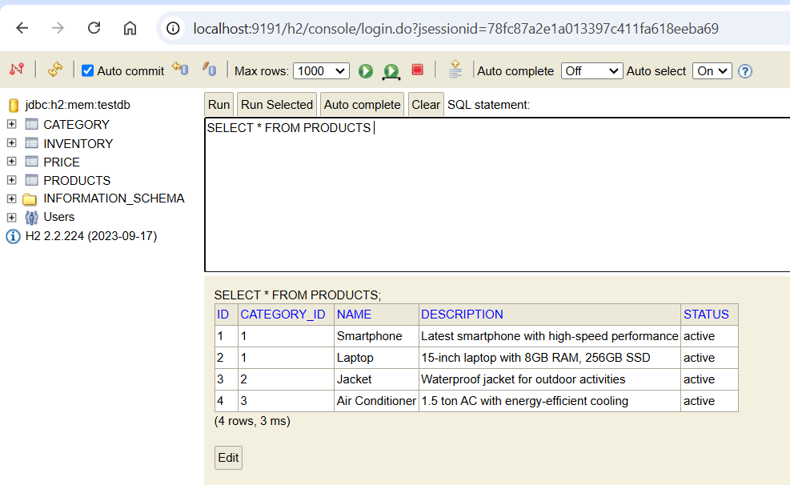
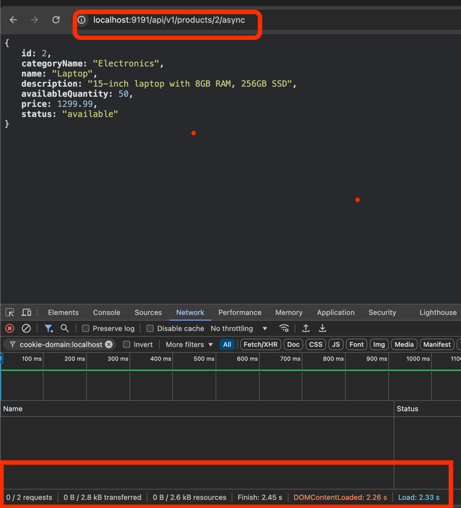
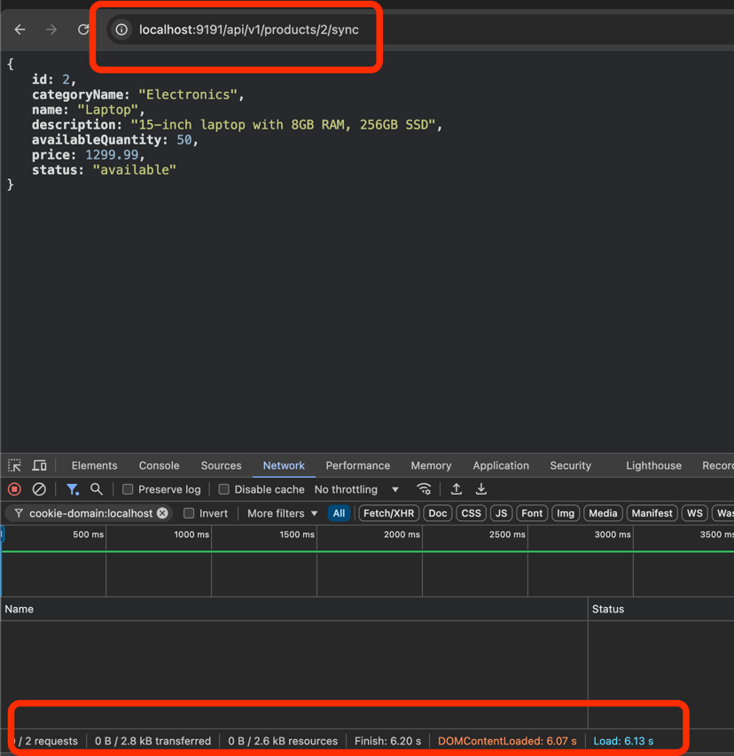

# springboot-api-performance
### spring.datasource.initialization-mode=always ensures that both schema.sql and data.sql are run at startup. schema.sql runs before data.sql
## h2
```text
http://localhost:9191/h2/console
```

## endpoints
```text
 http://localhost:9191/api/v1/products/2/async
```

```text
http://localhost:9191/api/v1/products/2/sync
```
