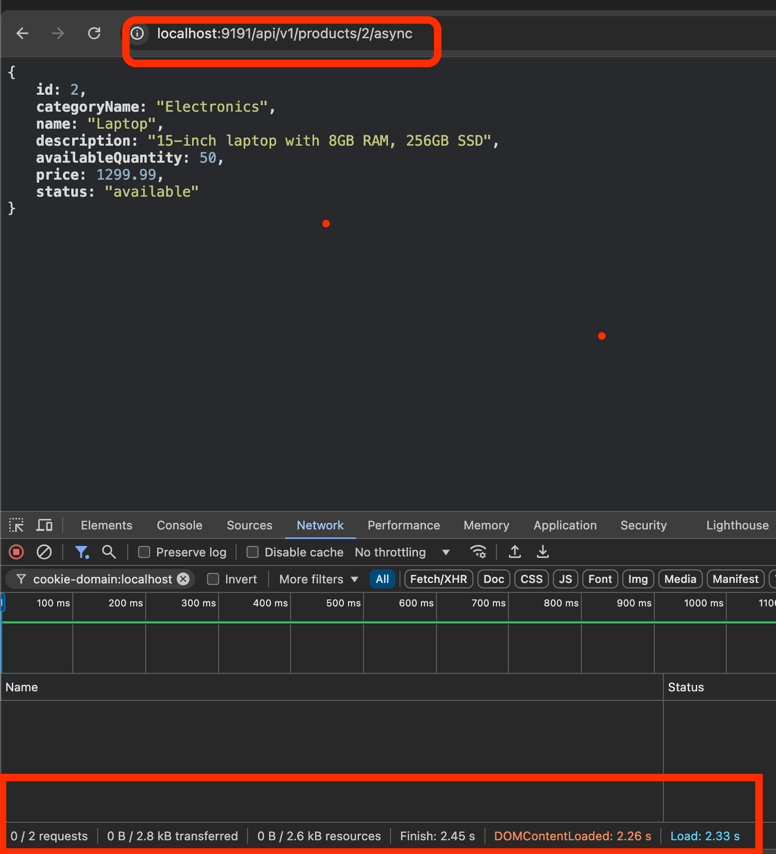
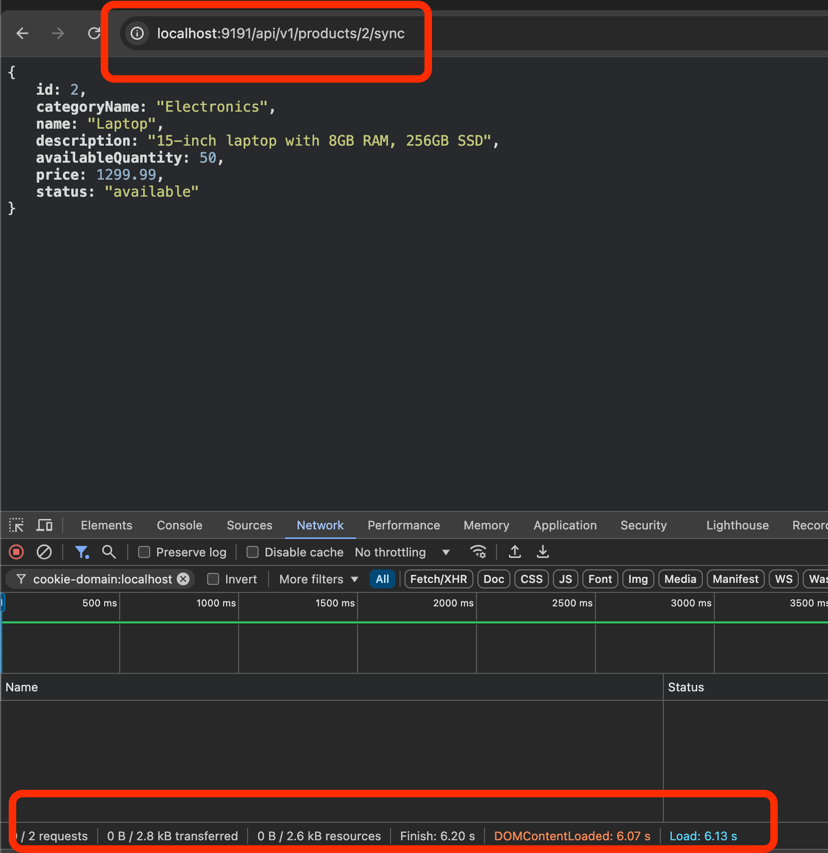

# springboot-api-performance
### spring.datasource.initialization-mode=always ensures that both schema.sql and data.sql are run at startup. schema.sql runs before data.sql
## h2
> http://localhost:9191/h2/console
## endpoints
> http://localhost:9191/api/v1/products/2/sync
> http://localhost:9191/api/v1/products/2/async

